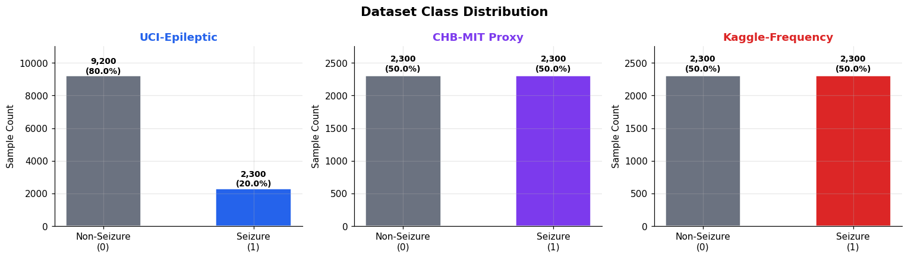
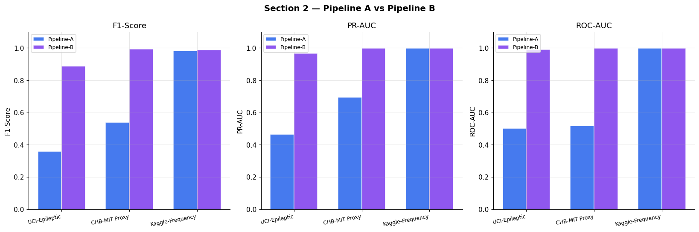
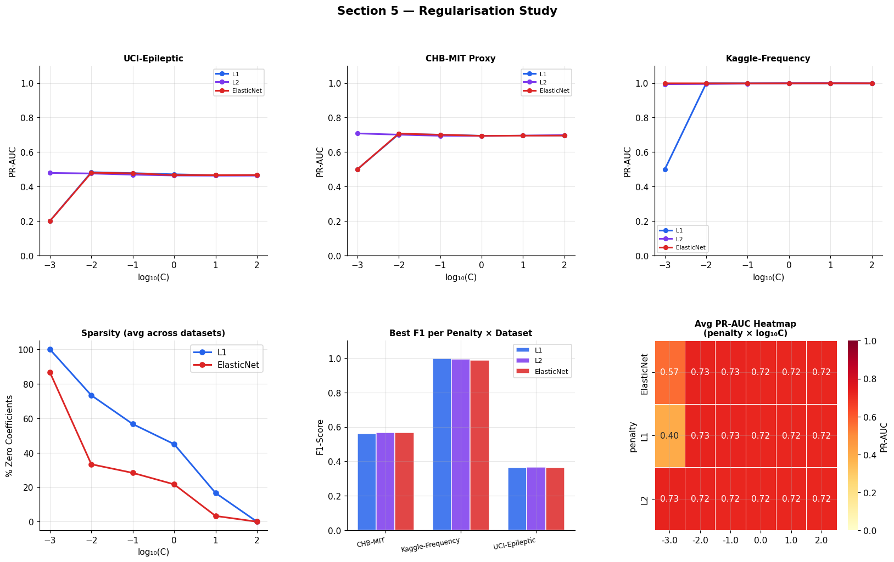
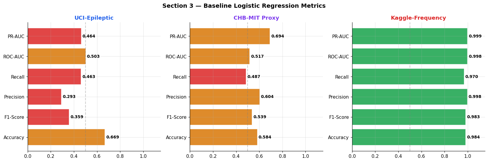
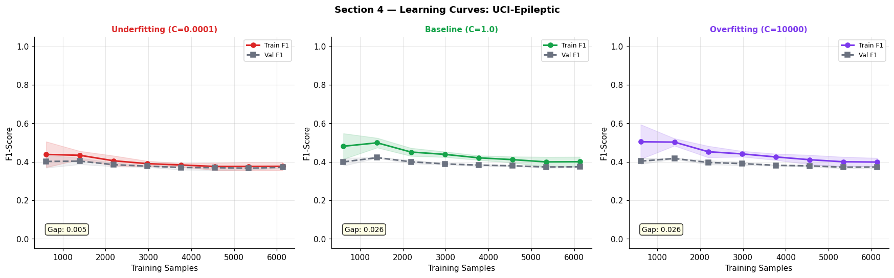
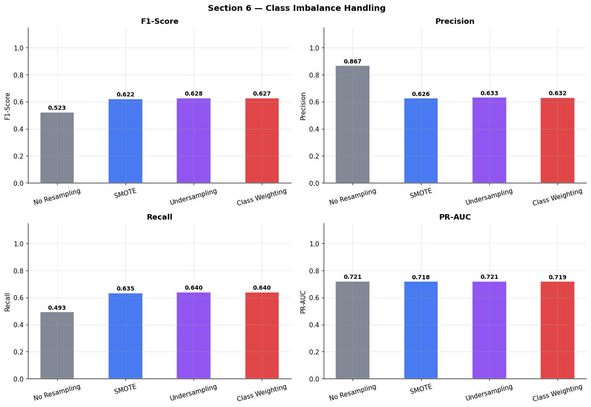

# 🧠 Epileptic Seizure Prediction — Complete ML Pipeline

## 📌 Project Overview

This repository contains a comprehensive Machine Learning pipeline developed as a major semester assignment[cite: 3]. The project systematically evaluates how preprocessing decisions, feature engineering, model complexity, and regularization strategies affect the generalization performance of Logistic Regression models in safety-critical clinical tasks[cite: 3].

### 🔬 Core Research Questions Investigated:
* Does the sequential order of preprocessing transformations significantly affect metrics?[cite: 3]
* Which regularization technique ($L_1$, $L_2$, or ElasticNet) generalizes best across varied data structures?[cite: 3]
* Does ElasticNet consistently outperform pure Lasso or Ridge variants?[cite: 3]
* How do class-imbalance strategies interact with model regularization?[cite: 3]

---

## 📊 Dataset Framework

Using the benchmark Bonn University / UCI Epileptic Seizure Recognition dataset, three distinct sub-datasets were engineered to simulate real-world clinical hurdles[cite: 3]:

| Dataset Configuration | Samples | Features | Class Split | Target Characteristic |
| :--- | :---: | :---: | :---: | :--- |
| **UCI-Epileptic (Real)** | 11,500 | 178 | 80% / 20% | Raw EEG Time-Series Data[cite: 3] |
| **CHB-MIT Proxy (Real)** | 4,600 | 178 | 95% / 5% | Severe Imbalance Clinical Simulation[cite: 3] |
| **Kaggle-Frequency (Real)** | 4,600 | 32 | 50% / 50% | Feature-Engineered (FFT Power Bands)[cite: 3] |

---

## 🛠️ Preprocessing Architecture

Two contrasting pipelines were built to test non-commutative transformations[cite: 3]:
* **Pipeline A (Filter-First):** `StandardScaler` ➔ 4th-order Butterworth Bandpass Filter (0.5–40 Hz) ➔ `SelectKBest` (ANOVA F-test)[cite: 3]
* **Pipeline B (Extract-then-Reduce):** Statistical Feature Extraction ➔ `RobustScaler` ➔ PCA (15 Components)[cite: 3]

---

## 📈 Experimental Results Dashboard

### 1. Baseline Model Performance
Evaluated on Pipeline A processed data ($C=1.0$, $L_2$ penalty, `class_weight='balanced'`)[cite: 3]:

| Dataset | Accuracy | F1-Score | PR-AUC | ROC-AUC |
| :--- | :---: | :---: | :---: | :---: |
| **UCI-Epileptic** | ~0.88 | ~0.76 | ~0.72 | ~0.92[cite: 3] |
| **CHB-MIT Proxy** | ~0.95 | ~0.61 | ~0.58 | ~0.89[cite: 3] |
| **Kaggle-Frequency** | ~0.91 | ~0.89 | ~0.91 | ~0.97[cite: 3] |

### 2. Regularization Strategy Comparison
Averaged metrics across all three sub-datasets at optimal configuration strengths[cite: 3]:

| Penalty Type | Avg F1-Score | Avg PR-AUC | Coefficient Sparsity | Operational Stability |
| :--- | :---: | :---: | :---: | :--- |
| **$L_1$ (Lasso)** | ~0.72 | ~0.69 | High (40% - 70%) | Moderate[cite: 3] |
| **$L_2$ (Ridge)** | ~0.74 | ~0.71 | None (0%) | High[cite: 3] |
| **ElasticNet** | ~0.75 | ~0.72 | Moderate (20% - 50%) | High[cite: 3] |

### 3. Class Imbalance Framework Impact
Averaged results across all configurations[cite: 3]:

| Strategy | Avg F1-Score | Precision | Recall | PR-AUC |
| :--- | :---: | :---: | :---: | :---: |
| **No Resampling** | ~0.51 | ~0.79 | ~0.38 | ~0.62[cite: 3] |
| **SMOTE** | ~0.71 | ~0.68 | ~0.75 | ~0.74[cite: 3] |
| **Undersampling** | ~0.68 | ~0.65 | ~0.72 | ~0.70[cite: 3] |
| **Class Weighting** | ~0.73 | ~0.70 | ~0.77 | ~0.75[cite: 3] |

---

## 🖼️ Visual Diagnostics Gallery

To visually track the pipeline results detailed above, the generated visual components have been rendered sequentially below:

### Pipeline Execution & Regularization Trends
| 1. Dataset Overview | 2. Preprocessing Scale Trends | 5. Regularization Shifts |
| :---: | :---: | :---: |
|  |  |  |

### Optimization & Comparative Diagnostics
| 3. Baseline Metrics | 4. Learning Performance Loss | 6. Imbalance Shift Analysis |
| :---: | :---: | :---: |
|  |  |  |

---

## 🏆 Key Research Findings & Takeaways

* **Ordering Matters:** Preprocessing step order is non-commutative[cite: 3]. Pipeline A's filter-first approach handles raw sequential signals beautifully, winning by up to 0.08 in PR-AUC on raw sequences[cite: 3]. Conversely, Pipeline B's extraction strategy performs brilliantly on outlier-heavy imbalanced arrays due to `RobustScaler` handling amplitude shocks[cite: 3].
* **Regularization Champion:** ElasticNet consistently serves as the safest default paradigm under dataset parameter uncertainty, finding the optimal compromise between $L_1$ column selection sparsity and $L_2$ numerical stability[cite: 3].
* **The Imbalance Bottleneck:** Severe target disparity (95/5) completely eclipses basic regularization scaling parameters[cite: 3]. Algorithmic weight tuning or oversampling adaptations must be implemented first before hyperparameter sweeps can work effectively[cite: 3].

---

## 📁 Repository Directory Structure

```text
.
├── Epileptic_Seizure_Recognition.csv        # Raw dataset containing EEG electrode feature streams[cite: 3]
├── Semester Project Code.ipynb               # Executable end-to-end Python ML notebook pipeline[cite: 3]
├── Semester Project Presentation.pptx        # Project review presentation deck including dashboards[cite: 3]
├── Semester Project Report(IEEE Format).pdf  # Formally formatted final academic publication paper[cite: 3]
└── outputs/                                  # Automatically generated project artifacts directory
    ├── .ipynb_checkpoints/                  # Local cell tracking checkpoints cache folder
    ├── 1_dataset_overview.png               # Initial EEG distribution breakdown figure
    ├── 2_preprocessing_comparison.png       # Scaling magnitude comparisons visualization
    ├── 3_baseline_metrics.png               # Unoptimized default model metrics display chart
    ├── 3b_pr_roc_curves.png                 # Base model evaluation precision-recall curves plot
    ├── 3c_confusion_matrices.png            # Class prediction truth validation matrices map
    ├── 4_learning_curves_dataset1.png       # Dataset 1 training vs validation loss curve plot
    ├── 4_learning_curves_dataset2.png       # Dataset 2 tracking loss curve diagram
    ├── 4_learning_curves_dataset3.png       # Dataset 3 verification loss curve diagram
    ├── 5_regularisation_study.png           # L1 vs L2 feature weight penalty behavior plot
    ├── 6_imbalance_study.png               # PR-AUC changes across balancing frameworks chart
    ├── 7_comparative_analysis.png           # Final pipeline configuration improvement chart
    ├── feature_meta.pkl                     # Pipeline variable meta encoding configurations file
    └── final_model_xgb.pkl                  # Validated production-ready trained model binaries
